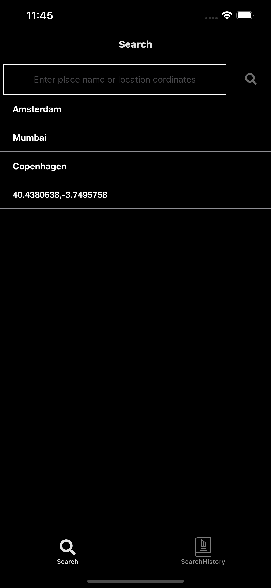
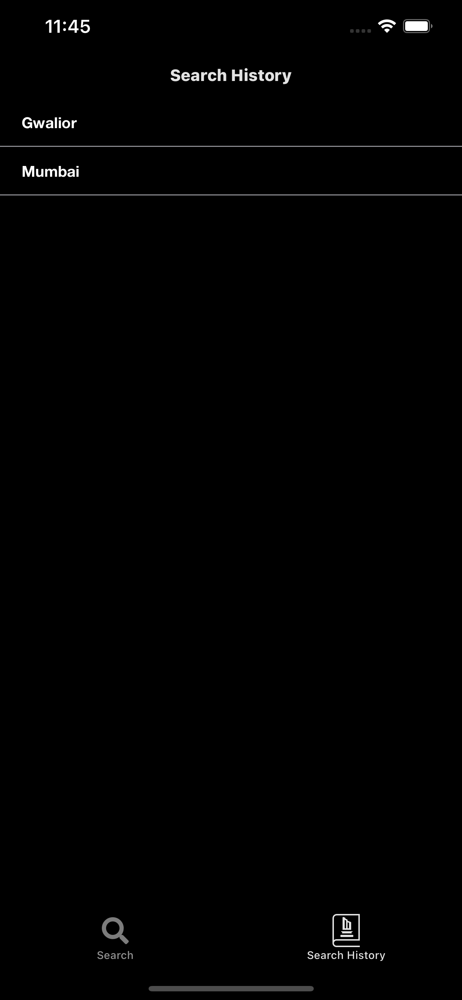
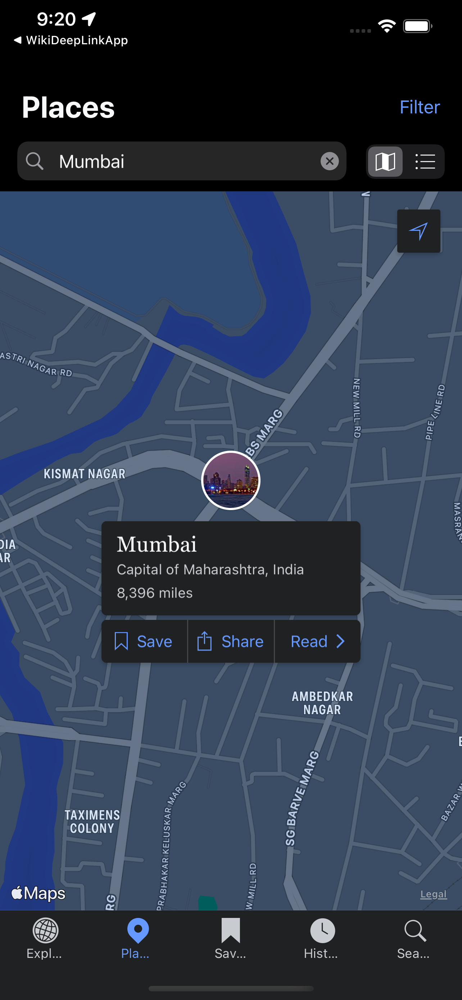
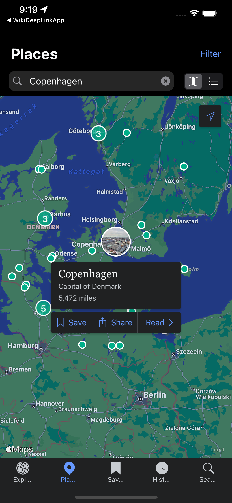
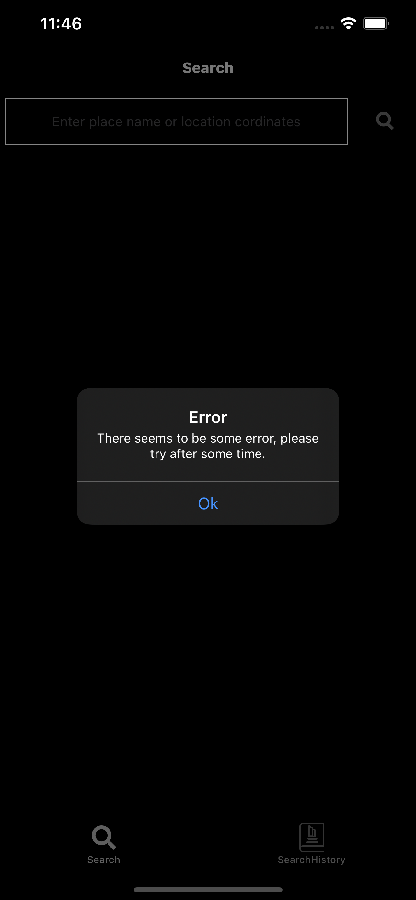
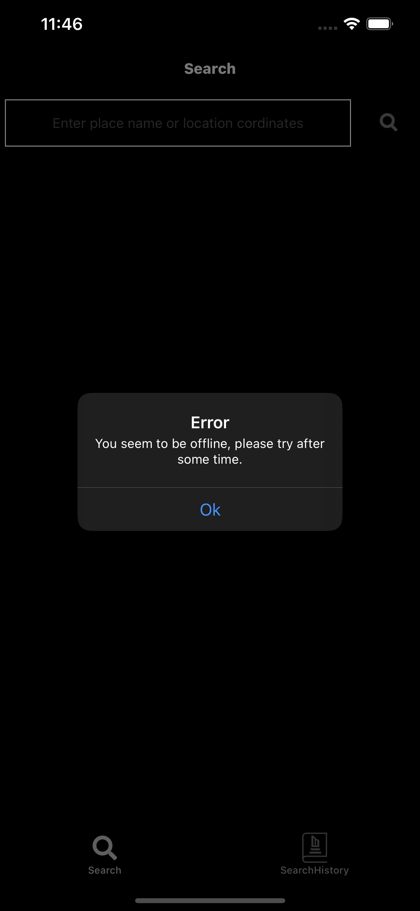
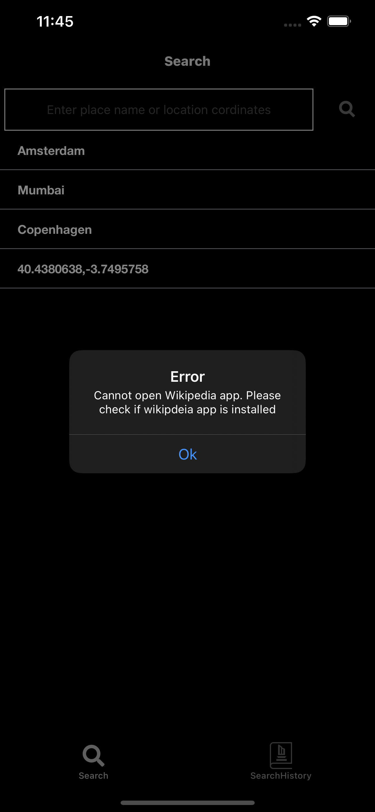
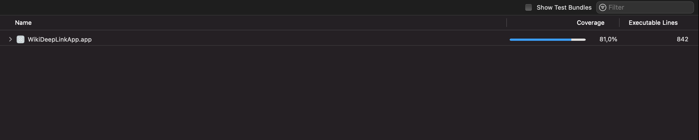

# WikiDeepLinkApp
WikiDeepLinkApp shows two tab Search and SearchHistory, Search screen shows the locations list fetched from locations API, Selecting a place will navigate user to Wikipedia app with selected place annotated. User is also allowed to enter place name eg "Amsterdam" or location coordinates eg. "12.9716, 77.5946" and then tapping on Search icon will navigate user to the Wikipedia app with the typed place name location on map, SearchHistory shows the searched text, recently searched text is shown at top. 

### Features
- WikiDeepLinkApp app shows Now Playing movies at top of the screen, Also shows popular movies as list that can be scrolled endless. 
- User can see the details of movie in a separate screen by selecting each movie from the list.
- App supports light mode and dark mode.
- App supports portrait mode.
- App has been localised for english and can be extended to support other language.
- The app shows movies in online mode.
- App supports iOS version 14.x and above. Tested on iPhone 11, iPhoneX, iPhone6s with iOS version 14.6 and iOS 15.1.1.

## Notes
- WikiDeepLinkApp app gets list of all locations from https://raw.githubusercontent.com/abnamrocoesd/assignment-ios/main/locations.json. 
- The app will show an error popup "There seems to be some issue, please try after some time." in case of any error occurred during the API call.
-  App also shows error in case of no internet connectivity.
- The app saves recently search data, recently search data can be seen in SearchHistory tab.

## Sample Screens

 

### Prerequisites
You would need a macbook with XCode 13.x installed. I built the app with XCode 13.1

## User Guide to use the app
- On Launch, launch screen is shown then Home screen is shown which consists of two tab search and SearchHistory, search is loaded with locations fetched from the locations api.
- Any location or coordinate can be searched in this tab, in second tab recently searched item can be seen. 
- On tapping any location, wikipedia app will be opened with place tab and shows the location entered or selected by user.
- On tapping any location from SearchHistory tab will open wikipedia app with place tab being selected and shows the location.

	
## Technical Details

### Third Party
- No third party library is used.

### App Architecture
- VIP Clean Architecture is used in the app.
- Network layer is based on protocol oriented design.

### Language
- Swift language has been used.

### Code Structure
Code is divided into following Groups
- APP group contains the Xcode auto generated AppDelegate, SceneDelegate and custom classs AppCoordinator, Coordinator and Screen.
- Data group contains the file which are responsible for persistence.
- Utilities contains Extension, Reachability, AlertService, Translation, GCD, Constants, Style, Colors, Fonts, URLProvider. This code is reusable generic code used through out the app.
- Networking group contains all the files related to network layer. It contains sub groups of NetworkManager, NetworkHelper, NetworkRouter, NetworkUtilities, EndPoints and NetworkServices.
- Model group contains the *LocationModel*, *Places* Which have been used in the app to pass the data to view.
- Scenes Contains Search and SearchHistory, which contains the modules with their respective view, Presenter, Interactor, Worker, Coordinator, ViewModel. 

### Unit Tests
- Unit test are written and provide a code coverage of 81.0 percent. see the screenshot attached.

Unit tests are arranged in two subgroups:
- Search contains tests written on View, Presenter, Interactor, Worker, Coordinator, It also contains Mock sub group that contains mock-up classes for MovieList.
- SearchHistory contains tests written on View, Presenter, Interactor, Worker, Coordinator, It also contains Mock sub group that contains mock-up classes for MovieDetail.
- Data contains tests written on Data Cache.
- Network subgroup contains tests written on Network Services
- Utility subgroup contains tests written on utility services
- MockNetworkService contains tests written on Network services.
